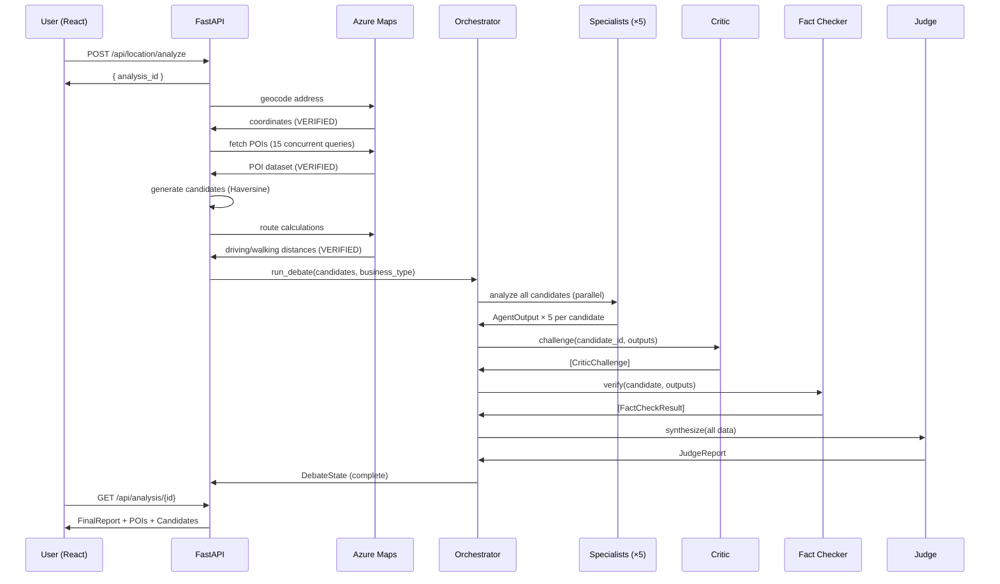
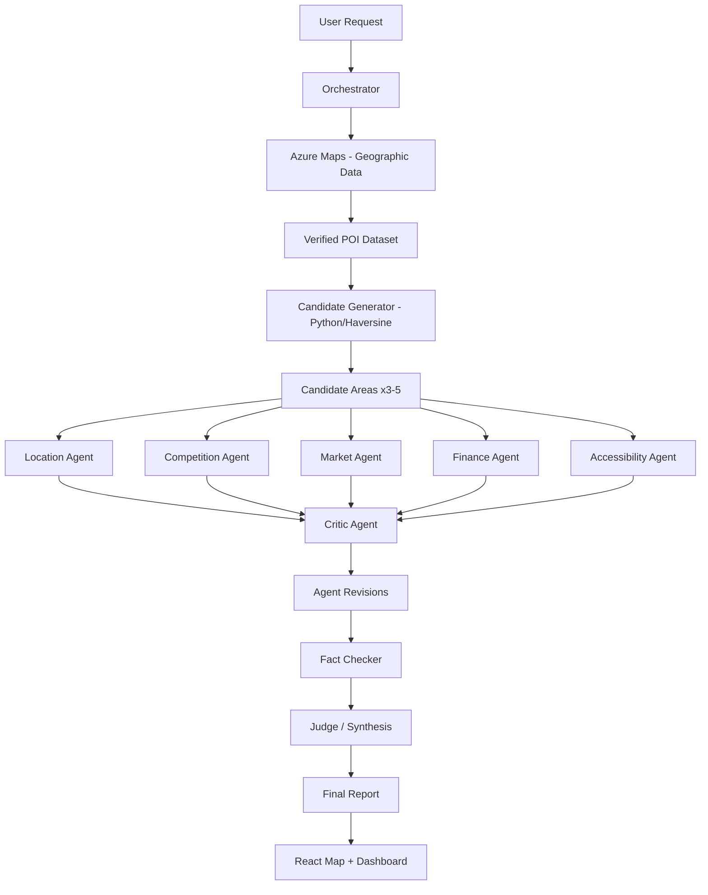

# LocalBiz AI — Architecture & Agent Workflow

## System Overview

LocalBiz AI is a distributed multi-agent AI system consisting of:
- A **React/Vite** frontend for user interaction and map visualization
- A **FastAPI** Python backend for all Azure service communication
- **Azure Maps** for verified geographic data (server-side only)
- **Azure AI Foundry** with a single GPT-5-mini deployment shared by all agents

```
Browser (React)
    ↕ HTTP/Axios (no Azure keys)
FastAPI Backend
    ├── Azure Maps REST API (subscription key server-side)
    └── Azure AI Foundry / GPT-5-mini (Entra ID auth)
```

---

## Frontend Architecture

### Technology
- **React 18** + **Vite** — SPA with hot module replacement
- **Tailwind CSS** — utility-first styling, dark AI dashboard theme
- **Azure Maps Web SDK 3** — loaded via CDN for map tile rendering
- **Axios** — HTTP client, all requests proxied to FastAPI
- **React Router 6** — client-side routing

### Key Design Decisions

**Azure Maps in browser**: The Azure Maps Web SDK renders map tiles using anonymous tile access. No subscription key is sent to the browser. All geographic queries (geocoding, POI search, routing) go through FastAPI.

**No credentials in JavaScript**: The React app only communicates with `/api/*` endpoints. All Azure service keys remain server-side.

### Routes
| Path | Component | Purpose |
|---|---|---|
| `/dashboard` | Dashboard | Summary overview |
| `/map-analysis` | MapAnalysis | Primary map + search UI |
| `/candidates` | Candidates | Candidate comparison grid |
| `/debate` | Debate | Full debate timeline |
| `/docs` | Docs | Documentation viewer |
| `/about` | About | Project architecture |

---

## Backend Architecture

### Technology
- **FastAPI** — async Python API framework
- **Pydantic v2** — strict input/output validation with typed schemas
- **httpx** — async HTTP client for Azure Maps REST API
- **azure-identity** — `DefaultAzureCredential` / `ClientSecretCredential`
- **azure-ai-projects** — `AIProjectClient.get_openai_client()` for GPT-5-mini

### Module Structure
```
backend/app/
├── main.py              # FastAPI app, CORS, routes, startup/shutdown
├── config.py            # Settings (pydantic-settings, reads .env)
├── schemas/
│   └── requests.py      # All Pydantic models for requests, responses, agent I/O
├── azure_maps/
│   ├── client.py        # Shared httpx.AsyncClient, subscription key management
│   ├── geocoding.py     # Address → coordinates, reverse geocoding
│   ├── search.py        # POI search (fuzzy, nearby), concurrent multi-category
│   ├── routes.py        # Driving/walking route calculation
│   └── categories.py   # Dynamic category extraction from POI data
├── agents/
│   ├── base_agent.py    # Abstract base: LLM call with retry and JSON validation
│   ├── location_agent.py
│   ├── competition_agent.py
│   ├── market_agent.py
│   ├── finance_agent.py
│   ├── accessibility_agent.py
│   ├── critic_agent.py
│   ├── fact_checker_agent.py
│   └── judge_agent.py
├── debate/
│   └── orchestrator.py  # Full debate workflow: rounds, parallel execution, events
├── services/
│   ├── analysis_service.py  # Main pipeline: geocode → POIs → candidates → debate
│   └── cache.py             # In-memory session cache
├── utils/
│   ├── geo_calc.py          # Haversine formula, coordinate offset, point-in-circle
│   └── candidate_generator.py  # Candidate area generation from POI data
└── routes/
    ├── location.py      # POST /api/location/search, POST /api/location/analyze
    ├── candidates.py    # GET /api/candidates/{id}, POST alternatives
    ├── debate.py        # GET /api/debate/{id}
    └── analysis.py      # GET /api/analysis/{id}, GET POIs
```

---

## Azure Services

### Azure Maps
- **Purpose**: Verified geographic data source
- **Authentication**: Subscription key (server-side only, `AZURE_MAPS_KEY`)
- **APIs called**: Search/Address, Search/Fuzzy, Search/Nearby, Route/Directions, Search/Address/Reverse
- **Never exposed to browser**

### Azure AI Foundry
- **Purpose**: GPT-5-mini model for all agent reasoning
- **Authentication**: Entra ID via `DefaultAzureCredential` / `ClientSecretCredential`
- **SDK**: `azure-ai-projects` → `AIProjectClient.get_openai_client()`
- **ONE deployment shared by all 9 agents** — no separate deployments created

---

## Complete Data Flow

```
User enters address + selects business type + radius
    ↓
React: POST /api/location/analyze
    ↓
FastAPI: Creates AnalysisSession (UUID), fires background task
    ↓
Azure Maps: geocode home address (VERIFIED)
    ↓
Azure Maps: fetch POIs in radius — 15+ concurrent category queries (VERIFIED)
    ↓
Python: deduplicate POIs, classify by category
    ↓
Python: generate_candidates() — Haversine-based placement (CALCULATED)
    ↓
Azure Maps: route calculation for each candidate — driving + walking (VERIFIED)
    ↓
DebateOrchestrator.run_debate()
    │
    ├── ROUND 1: asyncio.gather() → all 5 specialist agents in parallel
    │   ├── LocationAgent.analyze(candidate, business_type) → AgentOutput
    │   ├── CompetitionAgent.analyze(candidate, business_type) → AgentOutput
    │   ├── MarketAgent.analyze(candidate, business_type) → AgentOutput
    │   ├── FinanceAgent.analyze(candidate, business_type) → AgentOutput
    │   └── AccessibilityAgent.analyze(candidate, business_type) → AgentOutput
    │
    ├── ROUND 2: CriticAgent.challenge(candidate_id, all_outputs) → [CriticChallenge]
    │
    └── ROUND 3: FactCheckerAgent.verify(candidate, all_outputs) → [FactCheckResult]
              JudgeAgent.synthesize(candidate, specialists, critic, factchecks) → JudgeReport
    ↓
FinalReport assembled
    ↓
React polls /api/location/{id} + /api/debate/{id}
    ↓
React renders: map markers, candidate cards, debate timeline, evidence badges
```

---

## Agent Communication Format

### Orchestrator → Location Agent
```json
{
  "candidate_id": "candidate_a",
  "label": "Candidate A",
  "coordinates": { "latitude": 31.634, "longitude": 74.872 },
  "route_info": {
    "straight_line_km": 0.72,
    "driving_km": 1.1,
    "driving_minutes": 6.5,
    "walking_km": null,
    "walking_minutes": null
  },
  "poi_summary": { "restaurant": 3, "school": 2, "office": 5 },
  "competitor_count": 3,
  "geographic_profile": "Moderate competition | Office + Restaurant"
}
```

### Location Agent → Orchestrator
```json
{
  "agent": "location",
  "candidate_id": "candidate_a",
  "claims": [
    {
      "claim": "Candidate A is 0.72 km from home (straight-line)",
      "classification": "CALCULATED",
      "evidence_ids": []
    },
    {
      "claim": "Area has 5 offices and 3 restaurants within 400m",
      "classification": "VERIFIED",
      "evidence_ids": ["poi_office_1", "poi_office_2"]
    }
  ],
  "analysis": "Candidate A shows evidence of a commercial corridor with office density...",
  "risks": ["Driving route unavailable — accessibility uncertain"],
  "unknowns": ["Parking availability", "Actual pedestrian traffic"],
  "confidence": "medium",
  "score": 6.8
}
```

### Orchestrator → Competition Agent
```json
{
  "candidate_id": "candidate_b",
  "business_type": "burger_shop",
  "direct_competitor_count": 2,
  "competitors": [
    { "id": "poi_42", "name": "Burger Palace", "category": "burger", "distance_m": 280 },
    { "id": "poi_67", "name": "Fast Bites", "category": "fast food", "distance_m": 390 }
  ],
  "all_poi_summary": { "restaurant": 6, "school": 1, "office": 3 }
}
```

### Orchestrator → Critic Agent
```json
{
  "candidate_id": "candidate_b",
  "agent_outputs": [
    {
      "agent": "market",
      "claims": [{"claim": "3 colleges indicate strong demand", "classification": "AI_INFERENCE"}],
      "analysis": "Candidate B has strong demand because there are three colleges nearby...",
      "confidence": "high",
      "score": 8.5
    }
  ]
}
```

### Critic Agent Output
```json
{
  "challenges": [
    {
      "target_agent": "market",
      "candidate_id": "candidate_b",
      "challenged_claims": ["3 colleges indicate strong demand"],
      "reasoning": "The presence of colleges is only a demand indicator. The evidence does not establish customer conversion rates. Students may bring food from home or use on-campus facilities. The Market Agent's confidence rating of 'high' is not supported by the available data.",
      "severity": "high"
    }
  ],
  "overall_assessment": "The market analysis is overconfident relative to the available data.",
  "identified_contradictions": ["Market Agent rated high confidence while acknowledging unknown foot traffic"],
  "missing_risks": ["Competitor may target the same student demographic"]
}
```

### Fact Checker Input → Output
```json
// Input
{
  "candidate_id": "candidate_b",
  "claims_to_verify": [
    { "agent": "competition", "claim": "5 burger competitors within 500m", "classification": "VERIFIED" }
  ],
  "actual_azure_maps_data": {
    "competitor_count": 4,
    "competitors": [...]
  }
}

// Output
{
  "fact_checks": [
    {
      "claim": "5 burger competitors within 500m",
      "status": "CONTRADICTED",
      "actual_value": "4 competitors found in Azure Maps data",
      "reasoning": "Agent overstated competitor count. Azure Maps returned 4, not 5."
    }
  ],
  "verified_count": 3,
  "contradicted_count": 1
}
```

### Judge Final Report
```json
{
  "candidate_id": "candidate_b",
  "summary": "Candidate B currently has the strongest evidence profile among the analyzed areas...",
  "strengths": [
    "Lowest competition density (2 direct competitors) — VERIFIED",
    "Proximity to office cluster may indicate lunchtime demand — AI_INFERENCE",
    "Walking distance from home: 0.9 km — CALCULATED"
  ],
  "weaknesses": [
    "No transit access identified in available data",
    "Residential surroundings may limit evening/weekend trade"
  ],
  "uncertainties": [
    "Actual foot traffic: UNKNOWN",
    "Commercial rent: UNKNOWN",
    "Property availability: UNKNOWN"
  ],
  "items_requiring_physical_verification": [
    "Commercial rent in this area",
    "Property/unit availability",
    "Actual parking situation",
    "Pedestrian foot traffic at different times of day",
    "Local business licensing requirements"
  ],
  "ai_analysis_score": 7.2,
  "score_disclaimer": "AI Analysis Score reflects evidence quality and profile strength only. It is NOT a success probability or guarantee.",
  "recommendation": "Candidate B merits further investigation based on its current evidence profile",
  "evidence_quality": "medium",
  "debate_summary": "Market Agent was challenged for overconfidence on demand indicators. Competition count was contradicted (5 claimed vs 4 actual). Judge weighted verified data over AI inferences."
}
```

---

## Sequence Diagram



---

## Agent Workflow Diagram



---

## Security Architecture

| Component | Key/Secret | Location | Exposed to Browser? |
|---|---|---|---|
| Azure Maps | `AZURE_MAPS_KEY` | FastAPI `.env` | ❌ Never |
| Azure Foundry | `AZURE_CLIENT_SECRET` | FastAPI `.env` | ❌ Never |
| Azure Maps SDK | Anonymous tiles only | Browser CDN | ✅ Safe (tiles only) |
| API calls | None | Browser → `/api/*` | ✅ No credentials |

## Cost Optimization

- **MAX_CANDIDATES = 5**: Limits agent invocations
- **MAX_DEBATE_ROUNDS = 2**: Limits GPT calls
- **Parallel specialist execution**: Uses asyncio.gather (concurrent, not sequential)
- **Session cache**: Azure Maps data cached per session — no redundant calls
- **Python for math**: Distances, counts, filtering done in Python — no GPT needed
- **GPT used only for**: Reasoning, interpretation, debate, criticism, synthesis
