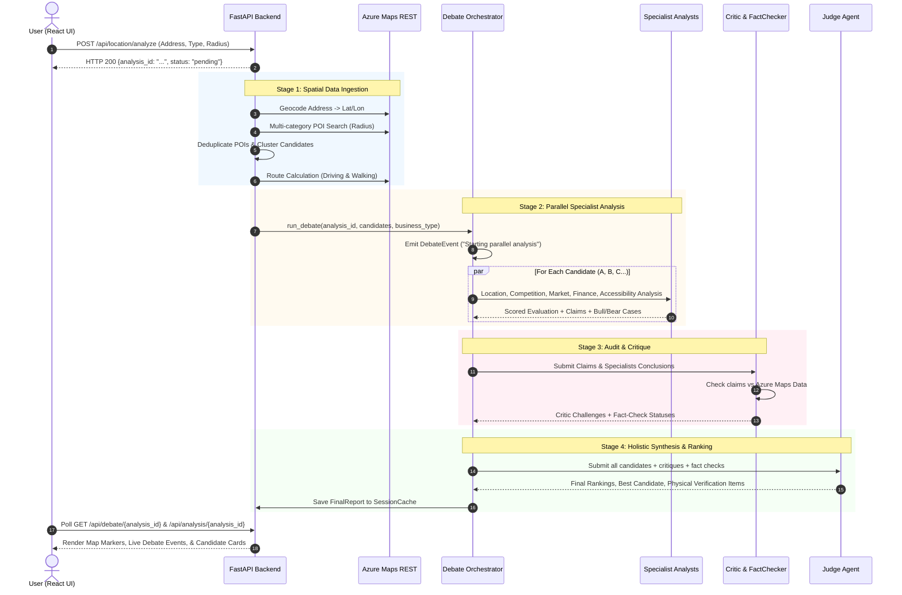

# 🤖 LocalBiz AI — Multi-Agent Architecture & Inter-Agent Workflow

This document provides a comprehensive technical reference for how all AI agents in **LocalBiz AI** function, communicate, and connect together to deliver evidence-based commercial location intelligence.

---

## 1. Architectural Philosophy & Grounding

Traditional AI chatbots suffer from two major flaws when giving business advice:
1. **Hallucination & Fabrication**: Inventing rent estimates, fake competitor numbers, or unrealistic foot traffic figures.
2. **Uncritical Optimism**: Giving vague affirmations ("Great spot!") without rigorous stress-testing.

LocalBiz AI solves this by deploying a **collaborative and adversarial multi-agent system** grounded in real geographic data from **Azure Maps REST APIs** and powered by Azure AI Foundry.

```
       ┌────────────────────────────────────────────────────────┐
       │             Azure Maps REST Services                   │
       │    (Geocoding, POI Search, Routing & Isochrones)       │
       └──────────────────────────┬─────────────────────────────┘
                                  │ Real Geographic Facts
                                  ▼
 ┌──────────────────────────────────────────────────────────────────────────────┐
 │                        FastAPI Backend Engine                                │
 │                                                                              │
 │   ┌──────────────────────────────────────────────────────────────────────┐   │
 │   │                      Debate Orchestrator                             │   │
 │   │  - Manages rounds, candidate states, events & streaming               │   │
 │   └──────┬──────────────────────┬──────────────────────┬─────────────────┘   │
 │          │                      │                      │                     │
 │          ▼                      ▼                      ▼                     │
 │   ┌──────────────┐       ┌──────────────┐       ┌──────────────┐             │
 │   │  Location    │       │ Competition  │       │    Market    │             │
 │   │    Agent     │       │    Agent     │       │    Agent     │             │
 │   └──────┬───────┘       └──────┬───────┘       └──────┬───────┘             │
 │          │                      │                      │                     │
 │          ▼                      ▼                      │                     │
 │   ┌──────────────┐       ┌──────────────┐              │                     │
 │   │   Finance    │       │Accessibility │              │                     │
 │   │    Agent     │       │    Agent     │              │                     │
 │   └──────┬───────┘       └──────┬───────┘              │                     │
 │          └──────────────┬───────┴──────────────────────┘                     │
 │                         ▼                                                    │
 │                  Candidate Claims                                            │
 │                         │                                                    │
 │          ┌──────────────┴──────────────┐                                     │
 │          ▼                             ▼                                     │
 │   ┌──────────────┐              ┌──────────────┐                             │
 │   │ Critic Agent │ (Challenges) │ Fact Checker │ (Audits claims vs data)     │
 │   └──────┬───────┘              └──────┬───────┘                             │
 │          └──────────────┬──────────────┘                                     │
 │                         ▼                                                    │
 │                  Audited Evidence                                            │
 │                         │                                                    │
 │                         ▼                                                    │
 │                 ┌──────────────┐                                             │
 │                 │  Judge Agent │                                             │
 │                 │  (Synthesis) │                                             │
 │                 └──────┬───────┘                                             │
 │                        │                                                     │
 └────────────────────────┼─────────────────────────────────────────────────────┘
                          │ FinalReport & Event Stream
                          ▼
            React Frontend (Map, Cards, Debate)
```

---

## 2. The 4-Tier Evidence Classification Framework

Every statement produced by any specialist agent must be classified into one of four immutable evidence classes:

| Class | Definition | Example |
|---|---|---|
| **`VERIFIED`** | Explicitly present in the returned Azure Maps payload | *"3 competitor burger restaurants exist within 500m"* |
| **`CALCULATED`** | Mathematically derived from verified values (distance, speed) | *"Walking time is 8.2 minutes at 4.5 km/h"* |
| **`AI_INFERENCE`** | Logical interpretation or hypothesis derived from facts | *"High office density suggests strong lunch crowd potential"* |
| **`UNKNOWN`** | Critical data point not present in datasets (must NOT be guessed) | *"Storefront lease rate per sq.ft is UNKNOWN"* |

---

## 3. The 9 Agents: Roles, Guardrails & Specifications

All agents inherit from [`BaseAgent`](file:///d:/azure-ai-project/localbiz-ai/backend/app/agents/base_agent.py), which handles asynchronous non-blocking LLM execution (`asyncio.to_thread`) through Azure AI Foundry, JSON schema enforcement, and automatic retries.

### 3.1 Location Intelligence Agent ([`LocationAgent`](file:///d:/azure-ai-project/localbiz-ai/backend/app/agents/location_agent.py))
- **File**: `backend/app/agents/location_agent.py`
- **Domain**: Spatial layout, urban corridors, surrounding commercial anchors, and distance from user base.
- **Inputs**: Coordinates, POI summary, nearest landmark, straight-line distance, route info.
- **Key Prompt Rules**:
  - Only use verified geographic data; never invent landmarks.
  - Classify each claim (`VERIFIED`, `CALCULATED`, `AI_INFERENCE`).
  - Score reflects geographic evidence (0–10), NOT a success guarantee.

### 3.2 Competition Agent ([`CompetitionAgent`](file:///d:/azure-ai-project/localbiz-ai/backend/app/agents/competition_agent.py))
- **File**: `backend/app/agents/competition_agent.py`
- **Domain**: Direct and indirect rivals, competitor names, distances, and cluster dynamics.
- **Inputs**: List of competitor POIs with IDs, names, categories, and radial distance.
- **Key Prompt Rules**:
  - Use ONLY verified competitors from Azure Maps; NEVER invent competitor names.
  - Evaluate zero-competition areas as both first-mover opportunities and unvalidated demand risks.
  - Identify gaps in competitor data honestly.

### 3.3 Market & Demand Agent ([`MarketAgent`](file:///d:/azure-ai-project/localbiz-ai/backend/app/agents/market_agent.py))
- **File**: `backend/app/agents/market_agent.py`
- **Domain**: Footfall catalysts (schools, universities, hospitals, corporate towers, transit stations).
- **Inputs**: POI category counts and anchor institutions.
- **Key Prompt Rules**:
  - Demand indicators (e.g. 2 schools) are **indicators**, NOT proof of sales conversion.
  - Use cautious phrasing: *"evidence suggests"*, *"may indicate"*.
  - Strictly forbidden from assuming categories that are absent from the POI summary.

### 3.4 Finance & Cost Agent ([`FinanceAgent`](file:///d:/azure-ai-project/localbiz-ai/backend/app/agents/finance_agent.py))
- **File**: `backend/app/agents/finance_agent.py`
- **Domain**: Capital outlay feasibility, commercial tier estimation, customer ticket size vs rent pressure.
- **Inputs**: Geographic context, user budget (if provided), commercial density.
- **Key Prompt Rules**:
  - **CRITICAL**: Absolutely forbidden from fabricating specific rent numbers, profit forecasts, or revenue.
  - Must explicitly tag unknown factors: rent per sq.ft, municipal tax, physical lease availability.
  - Generates required **Physical Verification Items** for field scouting.

### 3.5 Accessibility & Transit Agent ([`AccessibilityAgent`](file:///d:/azure-ai-project/localbiz-ai/backend/app/agents/accessibility_agent.py))
- **File**: `backend/app/agents/accessibility_agent.py`
- **Domain**: Multimodal customer reach — driving times, walking times, bus/metro stops, parking presence.
- **Inputs**: Azure Maps Route Matrix (driving distance/time, walking distance/time, transit POIs).
- **Key Prompt Rules**:
  - Clearly distinguish straight-line Euclidean distance from true walking/driving road routes.
  - If parking POIs are 0, mark parking availability as `UNKNOWN` rather than assuming none exists.

### 3.6 Critic & Debate Agent ([`CriticAgent`](file:///d:/azure-ai-project/localbiz-ai/backend/app/agents/critic_agent.py))
- **File**: `backend/app/agents/critic_agent.py`
- **Domain**: The system's **adversary and auditor**. Finds logical fallacies, overconfidence, and contradictions.
- **Inputs**: Outputs and claims from all specialist agents.
- **Key Prompt Rules**:
  - Flag claims presented as fact without `VERIFIED` evidence.
  - Challenge unwarranted optimism (e.g., claiming 3 schools guarantees high revenue).
  - Highlight contradictions between agents (e.g., Market Agent claiming high confidence while Accessibility Agent notes poor connectivity).

### 3.7 Fact Checker Agent ([`FactCheckerAgent`](file:///d:/azure-ai-project/localbiz-ai/backend/app/agents/fact_checker_agent.py))
- **File**: `backend/app/agents/fact_checker_agent.py`
- **Domain**: Direct auditor comparing agent claims against the raw Azure Maps dataset.
- **Inputs**: Candidate claims vs Raw Azure Maps POIs, counts, and coordinates.
- **Outputs**:
  - `VERIFIED`: Confirmed by raw map data.
  - `CONTRADICTED`: Conflicts with map data (e.g. agent claimed 4 competitors, but raw data has 2).
  - `UNSUPPORTED`: Claim cannot be confirmed from available data.
  - `UNKNOWN`: No data exists.

### 3.8 Judge & Synthesis Agent ([`JudgeAgent`](file:///d:/azure-ai-project/localbiz-ai/backend/app/agents/judge_agent.py))
- **File**: `backend/app/agents/judge_agent.py`
- **Domain**: Objective arbiter. Produces the final verdict, candidate rankings, and physical checklist.
- **Inputs**: Specialist outputs, Critic challenges, Fact Checker audit table.
- **Key Prompt Rules**:
  - Never guarantee business success; always include Responsible AI disclaimers.
  - Synthesize trade-offs (e.g. low competition vs low foot traffic).
  - Extract the top required on-site physical inspection checklist.

### 3.9 Debate Orchestrator ([`DebateOrchestrator`](file:///d:/azure-ai-project/localbiz-ai/backend/app/debate/orchestrator.py))
- **File**: `backend/app/debate/orchestrator.py`
- **Domain**: Conductor of the entire multi-agent lifecycle.
- **Key Responsibilities**:
  - Dispatches parallel LLM tasks across candidates.
  - Emits real-time `DebateEvent` stream consumed by frontend UI.
  - Incorporates deterministic **Spatial Intelligence Heuristic Engine** as an instant, zero-latency fallback if external APIs are constrained.

---

## 4. End-to-End Workflow & Connection Sequence

The full end-to-end lifecycle runs through FastAPI background workers:



---

## 5. Dual Execution Mode: LLM & Spatial Heuristic Engine

To guarantee resilience, zero downtime, and instant responsiveness, LocalBiz AI incorporates a dual-mode engine:

1. **Azure AI Foundry (LLM Mode)**:
   - Queries GPT-5-mini via `azure-ai-projects` and `AzureOpenAI`.
   - Executes with JSON structured outputs (`response_format: {"type": "json_object"}`).
   - Formulates qualitative reasoning, nuanced customer segment definitions, and local marketing strategies.

2. **Deterministic Spatial Heuristic Engine (Fallback Mode)**:
   - If the LLM endpoint is unreachable, missing credentials, or rate-limited, [`DebateOrchestrator._generate_heuristic_candidate_analysis`](file:///d:/azure-ai-project/localbiz-ai/backend/app/debate/orchestrator.py#L204-L307) executes immediately:
     - **Location Score**: Derived from POI density, transit presence, and distance penalties.
     - **Competition Score**: Inverse logarithmic curve based on verified competitor counts (0 rivals = 9.8 blue ocean; 4+ rivals = < 4.2 high saturation).
     - **Market Score**: Weighted sum of educational, medical, and commercial anchor institutions.
     - **Finance Score**: Composite risk calculation based on competitive density and accessibility.
   - The analysis remains **100% grounded in real Azure Maps facts** without ever throwing an unhandled exception.

---

## 6. How to Test or Run Individual Agents Locally

When running individual agent files in Python, you may encounter:
```
ModuleNotFoundError: No module named 'app'
```

### Why this happens
Python adds the directory containing the executed script to `sys.path`. When running `python backend/app/agents/finance_agent.py`, Python sets `sys.path` to `backend/app/agents`, so it cannot resolve `from app.agents...`.

### The Correct Ways to Run

#### Option 1: Run as a Python Module (`-m`) from the backend folder
```powershell
cd d:\azure-ai-project\localbiz-ai\backend
.\.venv\Scripts\python.exe -m app.agents.finance_agent
```

#### Option 2: Set `PYTHONPATH`
```powershell
cd d:\azure-ai-project\localbiz-ai\backend
$env:PYTHONPATH="."
.\.venv\Scripts\python.exe app\agents\finance_agent.py
```

#### Option 3: Quick Standalone Test Script
You can write a lightweight verification script in `backend/test_agent.py`:
```python
import asyncio
from app.agents.location_agent import LocationAgent
from app.schemas.requests import Candidate, Coordinates, RouteInfo

async def test():
    # Instantiate or test agent logic
    print("Agent module imported and initialized successfully.")

if __name__ == "__main__":
    asyncio.run(test())
```
Run it via:
```powershell
cd d:\azure-ai-project\localbiz-ai\backend
.\.venv\Scripts\python.exe test_agent.py
```
